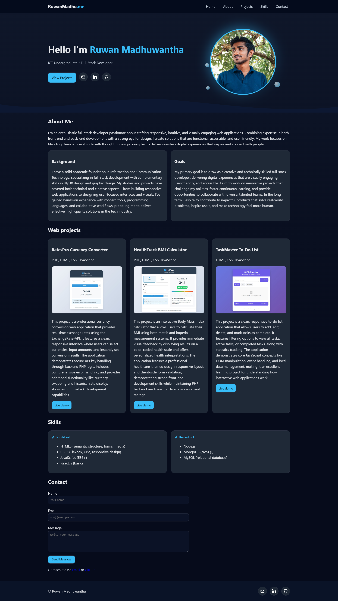

# 🌐 Personal Portfolio - Ruwan Madhuwantha

This is my personal portfolio website, showcasing my background, skills, and projects as an **ICT Undergraduate & Full-Stack Developer**.  
It highlights my journey, technical expertise, and selected web projects.  

🔗 **Live Demo:** [RuwanMadhu.me](https://ruwanmadhu.github.io/my-portfolio/)

---

## 📸 Preview
  

---

## 📝 About
The portfolio is designed to present:
- My **background** as an ICT undergraduate.  
- My **goals** as a developer.  
- A showcase of **projects** (with live demos).  
- My **skills** in both front-end and back-end development.  
- A **contact form** to connect with me directly.  

---

## 🚀 Features
- **Responsive Design** – Works across devices (desktop, tablet, mobile).  
- **Project Showcase** – Currency Converter, BMI Calculator, To-Do List.  
- **Clean & Minimal UI** – Focused on readability and usability.  
- **Contact Form** – Easy way to reach out.  

---

## 🛠️ Built With
- **Frontend:** HTML5, CSS3, JavaScript (ES6+)  
- **Backend (some projects):** PHP, Node.js  
- **Databases (used in projects):** MySQL, MongoDB  
- **Version Control:** Git & GitHub Pages for hosting  

---

## 📂 Projects Included
- **RatesPro Currency Converter** – Real-time currency conversion with ExchangeRate-API.  
- **HealthTrack BMI Calculator** – Interactive BMI calculator with visual feedback.  
- **TaskMaster To-Do List** – Manage tasks with add/edit/delete features.  

---

## 💻 Running Locally
If you’d like to run the portfolio locally:

```bash
# Clone the repository
git clone https://github.com/ruwanmadhu/my-portfolio.git

# Open the project folder
cd portfolio

# Open index.html in your browser
